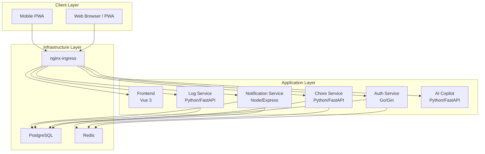
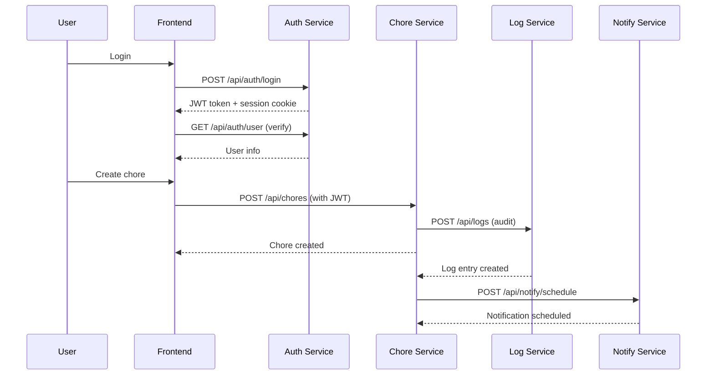
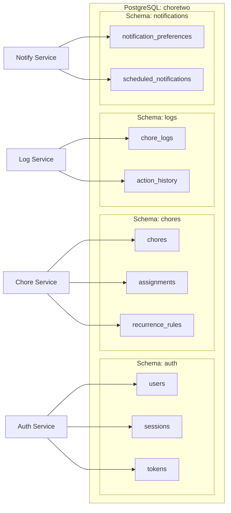
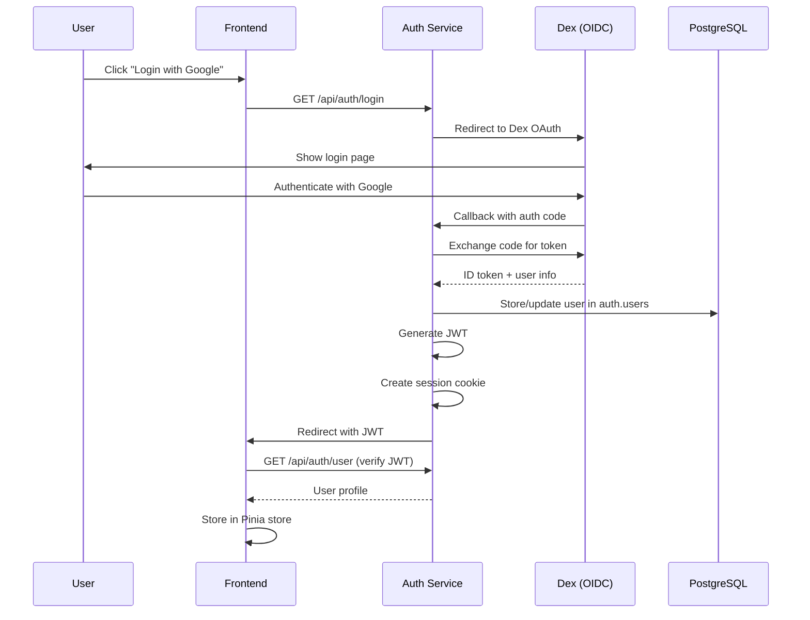
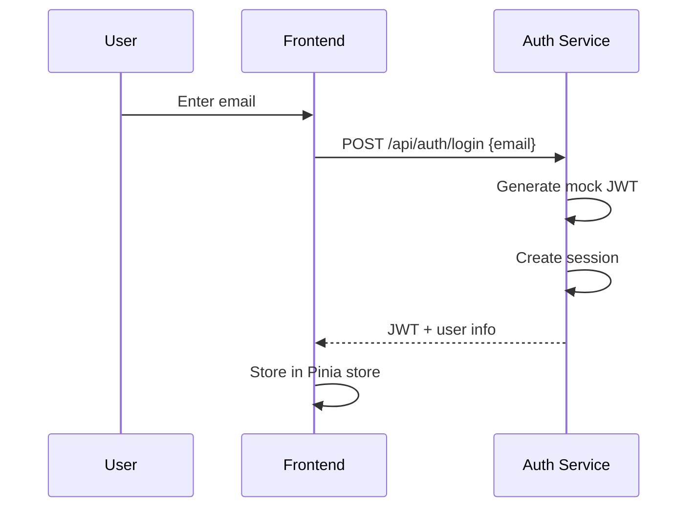
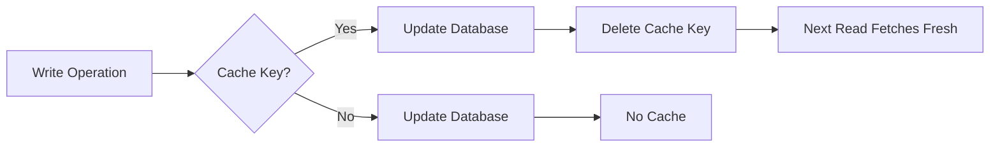
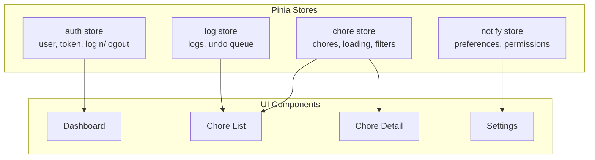
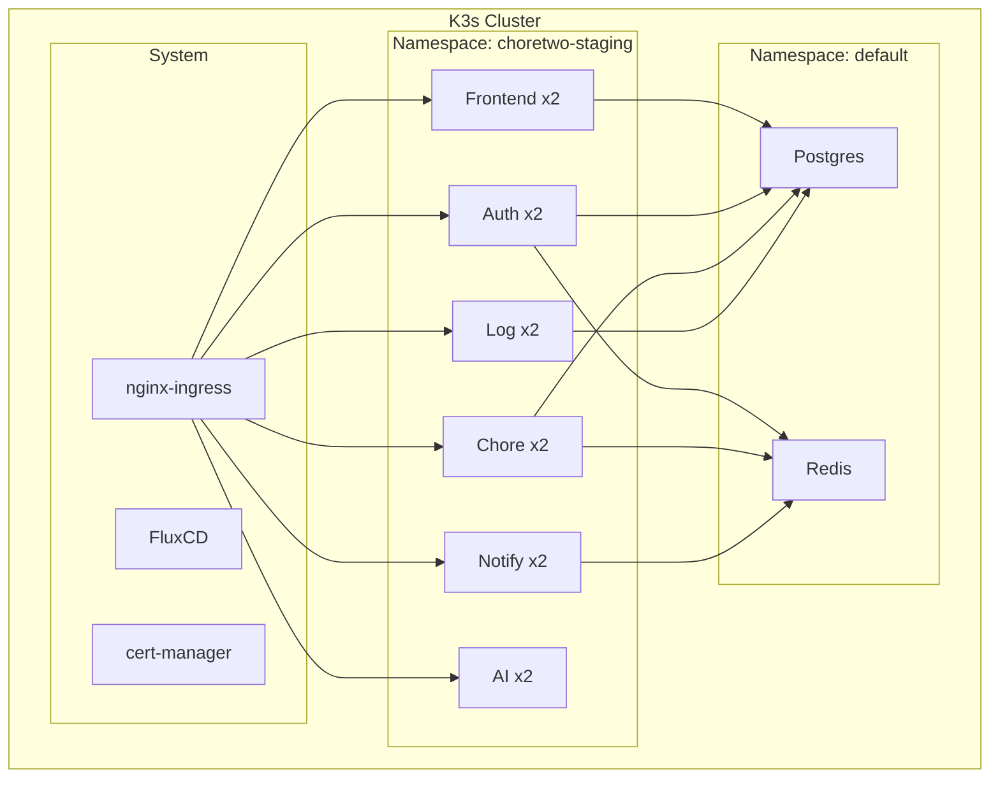

# Architecture

System architecture, service responsibilities, and data flow.

## System Overview

Choretwo is a microservices-based chore management platform with 6 independent services communicating through HTTP APIs.



## Service Architecture

### Service Responsibilities

| Service | Language | Port | Primary Responsibility |
|---------|----------|------|------------------------|
| Frontend | Vue 3 | 3000 | PWA UI, state management |
| Auth | Go | 8001 | Authentication, sessions, JWT |
| Chore | Python | 8002 | Chore CRUD, recurrence logic |
| Log | Python | 8003 | Audit trail, undo operations |
| Notification | Node.js | 8004 | Push notifications, scheduling |
| AI Copilot | Python | 8005 | NLP, smart suggestions |

### Service Communication Pattern



## Database Architecture

### Schema Isolation

Single PostgreSQL instance with schema-based isolation:



### Core Tables

#### Auth Schema
```sql
CREATE TABLE auth.users (
    email VARCHAR(255) PRIMARY KEY,
    name VARCHAR(255) NOT NULL,
    avatar_url TEXT,
    provider VARCHAR(50),
    provider_id VARCHAR(255),
    created_at TIMESTAMP DEFAULT NOW(),
    updated_at TIMESTAMP DEFAULT NOW()
);

CREATE TABLE auth.sessions (
    id UUID PRIMARY KEY,
    user_email VARCHAR(255) REFERENCES auth.users(email),
    jwt_token TEXT,
    expires_at TIMESTAMP,
    created_at TIMESTAMP DEFAULT NOW()
);
```

#### Chores Schema
```sql
CREATE TABLE chores.chores (
    id SERIAL PRIMARY KEY,
    name VARCHAR(255) NOT NULL,
    description TEXT,
    interval_days INT NOT NULL DEFAULT 7,
    due_date DATE NOT NULL,
    done BOOLEAN DEFAULT FALSE,
    done_by VARCHAR(255),
    last_done DATE,
    owner_email VARCHAR(255),
    is_private BOOLEAN DEFAULT FALSE,
    archived BOOLEAN DEFAULT FALSE,
    created_at TIMESTAMP DEFAULT NOW(),
    updated_at TIMESTAMP DEFAULT NOW()
);

CREATE TABLE chores.assignments (
    chore_id INT REFERENCES chores.chores(id),
    user_email VARCHAR(255) REFERENCES auth.users(email),
    assigned_at TIMESTAMP DEFAULT NOW(),
    PRIMARY KEY (chore_id, user_email)
);
```

#### Logs Schema
```sql
CREATE TABLE logs.chore_logs (
    id SERIAL PRIMARY KEY,
    chore_id INT,
    user_email VARCHAR(255),
    action_type VARCHAR(50) NOT NULL,
    action_details JSONB,
    previous_state JSONB,
    current_state JSONB,
    created_at TIMESTAMP DEFAULT NOW()
);

CREATE INDEX idx_chore_logs_chore_id ON logs.chore_logs(chore_id);
CREATE INDEX idx_chore_logs_user_email ON logs.chore_logs(user_email);
CREATE INDEX idx_chore_logs_created_at ON logs.chore_logs(created_at);
```

#### Notifications Schema
```sql
CREATE TABLE notifications.notification_preferences (
    user_email VARCHAR(255) PRIMARY KEY REFERENCES auth.users(email),
    enabled BOOLEAN DEFAULT TRUE,
    notify_times JSONB DEFAULT '["09:00", "18:00"]',
    notify_overdue BOOLEAN DEFAULT TRUE,
    notify_soon BOOLEAN DEFAULT TRUE,
    created_at TIMESTAMP DEFAULT NOW(),
    updated_at TIMESTAMP DEFAULT NOW()
);

CREATE TABLE notifications.scheduled_notifications (
    id SERIAL PRIMARY KEY,
    user_email VARCHAR(255),
    chore_id INT,
    scheduled_for TIMESTAMP,
    sent_at TIMESTAMP,
    notification_type VARCHAR(50),
    processed BOOLEAN DEFAULT FALSE
);
```

## Authentication Flow

### OAuth2 with Dex (Production)



### Mock Auth (Development)



### JWT Structure

```json
{
  "sub": "user@example.com",
  "name": "User Name",
  "iat": 1640000000,
  "exp": 1640086400,
  "iss": "choretwo-auth",
  "aud": "choretwo-frontend"
}
```

## API Gateway Pattern

### nginx-ingress Configuration

All external traffic routes through nginx-ingress with path-based routing:

```yaml
apiVersion: networking.k8s.io/v1
kind: Ingress
metadata:
  name: choretwo-ingress
  annotations:
    cert-manager.io/cluster-issuer: letsencrypt-prod
    nginx.ingress.kubernetes.io/rewrite-target: /
spec:
  ingressClassName: nginx
  tls:
    - hosts:
        - choretwo.stillon.top
      secretName: choretwo-tls
  rules:
    - host: choretwo.stillon.top
      http:
        paths:
          - path: /api/auth
            pathType: Prefix
            backend:
              service: auth-service
              port:
                number: 80
          - path: /api/chores
            pathType: Prefix
            backend:
              service: chore-service
              port:
                number: 80
          - path: /api/logs
            pathType: Prefix
            backend:
              service: log-service
              port:
                number: 80
          - path: /api/notify
            pathType: Prefix
            backend:
              service: notify-service
              port:
                number: 80
          - path: /api/ai
            pathType: Prefix
            backend:
              service: ai-service
              port:
                number: 80
          - path: /
            pathType: Prefix
            backend:
              service: frontend
              port:
                number: 80
```

## Caching Strategy

### Redis Usage

| Service | Cache Key Pattern | Purpose | TTL |
|---------|-------------------|---------|-----|
| Auth | `session:{jwt_token}` | Session validation | 24h |
| Chore | `chore:{id}` | Chore data | 5m |
| Chore | `user_chores:{email}` | User chore list | 5m |
| Notify | `prefs:{email}` | User preferences | 1h |

### Cache Invalidation



## Frontend Architecture

### State Management (Pinia)



### Component Hierarchy

```
App.vue
├── AppHeader.vue
│   ├── UserMenu.vue
│   └── ThemeToggle.vue
├── RouterView
│   ├── LoginView.vue
│   ├── DashboardView.vue
│   │   ├── ChoreStats.vue
│   │   ├── UpcomingChores.vue
│   │   └── RecentLogs.vue
│   ├── ChoreListView.vue
│   │   ├── ChoreCard.vue
│   │   ├── FilterPills.vue
│   │   └── AddChoreButton.vue
│   ├── LogView.vue
│   └── SettingsView.vue
└── AppFooter.vue
```

## Service-to-Service Communication

### HTTP API Calls

Services communicate via HTTP with JWT authentication:

```go
// Auth service validates JWT, adds user context
func AuthMiddleware() gin.HandlerFunc {
    return func(c *gin.Context) {
        token := extractToken(c)
        claims, err := validateJWT(token)
        if err != nil {
            c.JSON(401, gin.H{"error": "invalid token"})
            c.Abort()
            return
        }
        c.Set("user_email", claims.Subject)
        c.Next()
    }
}
```

### Error Handling

```json
{
  "error": "Chore not found",
  "code": "CHORE_NOT_FOUND",
  "details": {
    "chore_id": 123
  }
}
```

## Security Architecture

### Security Layers

1. **Transport Layer**: TLS 1.3 (cert-manager + letsencrypt-prod)
2. **Authentication**: JWT + secure session cookies
3. **Authorization**: Service-level auth middleware
4. **Data Isolation**: Schema-based database isolation
5. **Secrets Management**: SealedSecrets for K8s

### CORS Configuration

```go
config := cors.DefaultConfig()
config.AllowOrigins = []string{"https://choretwo.stillon.top"}
config.AllowCredentials = true
config.AllowHeaders = []string{"Authorization", "Content-Type"}
config.MaxAge = 12 * time.Hour
```

## Scalability Considerations

### Horizontal Scaling

- **Stateless services**: Auth, Chore, Log, AI can scale horizontally
- **Session storage**: Redis-backed sessions for auth service
- **Database**: Read replicas for chore queries (future)

### Performance Optimization

- **CDN**: Static assets served via CDN (future)
- **Caching**: Redis for frequently accessed data
- **Database indexing**: Composite indexes on user_email + status
- **Lazy loading**: Frontend code splitting by route

## Deployment Architecture

### K3s Cluster Structure



## Monitoring & Observability

### Health Checks

```yaml
livenessProbe:
  httpGet:
    path: /api/auth/health
    port: 8000
  initialDelaySeconds: 10
  periodSeconds: 30

readinessProbe:
  httpGet:
    path: /api/auth/health
    port: 8000
  initialDelaySeconds: 5
  periodSeconds: 10
```

### Logging Strategy

- **Structured logging**: JSON format
- **Centralized logging**: Fluentd + Elasticsearch (future)
- **Log retention**: 7 days in K8s, 30 days in ELK

## Future Enhancements

1. **WebSocket Support**: Real-time chore updates
2. **GraphQL API**: Flexible data fetching
3. **Multi-region**: Geo-distributed deployment
4. **Event Sourcing**: Chore state as event stream
5. **ML Pipeline**: Advanced AI predictions

---

**Next**: [DEVELOPMENT.md](./DEVELOPMENT.md) - Set up your development environment
